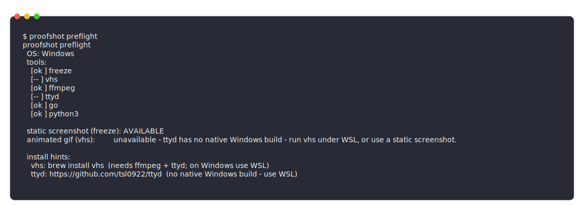

<div align="center">

# 📸 cliproof

**Prove your CLI actually works — and keep it true.**

Capture a **real** terminal command and its **real** output as a polished
screenshot (or GIF), redact any secrets, and embed it into your `README.md` as
proof-it-runs evidence — then let CI **fail if that proof ever goes stale.**

[](https://github.com/aks-builds/cliproof/actions/workflows/ci.yml)
[](https://github.com/aks-builds/cliproof/actions/workflows/codeql.yml)
[](https://www.npmjs.com/package/cliproof)
[](./LICENSE.md)
[](https://www.anthropic.com/engineering/equipping-agents-for-the-real-world-with-agent-skills)

<br/>



<sub>☝️ A real cliproof capture — generated by this repo's own skill, of its own <code>preflight</code> command.</sub>

</div>

---

## Why cliproof

A README that *says* "it works" convinces no one. A screenshot of the command
actually running — version banner, passing tests, real output — convinces
everyone in two seconds. cliproof makes that screenshot **honest, repeatable,
and durable**: it runs the real command, captures the genuine output, strips
any secrets, embeds it in your README, and can re-check in CI that the command
still produces the same result.

It works as a **Claude Code Agent Skill**, an installable **plugin**, and an
**agent-agnostic npm CLI** (`npm i -g cliproof`) for Cursor, Codex, OpenCode,
Gemini CLI, Windsurf, or any agent that runs shell commands.

## How is this different?

Most "agent eyes" tools verify *browser/UI* sessions. cliproof verifies the
**terminal** — the build, the test run, the CLI itself — and turns it into
durable README proof.

| | screenshot/GIF tools | browser-proof tools | **cliproof** |
|---|:---:|:---:|:---:|
| Real command + real output | ✅ | ➖ (browser) | ✅ |
| Static screenshot (themed window) | some | ❌ | ✅ |
| Animated GIF | ✅ | ✅ | ✅ |
| Enforced secret redaction | ❌ | ❌ | ✅ |
| Destructive-command guard | ❌ | ❌ | ✅ |
| Idempotent README embed | ❌ | ❌ | ✅ |
| **CI freshness check (fails when proof drifts)** | ❌ | ❌ | ✅ |
| Pass/fail verify (10+ langs) | ❌ | ✅ | ✅ |
| Proof → PR comment | ❌ | ✅ | ✅ |
| Agent-agnostic install | ❌ | ✅ | ✅ |
| Zero-dependency, no-network core | ❌ | ❌ | ✅ |

<sub>cliproof's ✅s are backed by tests — see [Testing](#testing). (Animated GIF is exercised best-effort in CI since it needs `ttyd`; the PR-comment *post* is a `gh` side-effect, only its body is unit-tested.)</sub>

## Features

- 📸 **Static screenshots** — macOS/iOS window or Windows-terminal look, one-flag themes (`--preset macos|github-dark|nord|iterm|win11`).
- 🎬 **Animated GIFs** — scripted typing + live output via `vhs`.
- 🔒 **Enforced secret redaction** — masks API keys, tokens, JWTs, private keys; normalises emails/IPs/home paths *before* anything is committed. Extend with a `.cliproof/redact.json` policy (custom patterns + allowlist).
- 🛡️ **Command-safety guard** — refuses destructive/exfiltration commands (`rm -rf /`, `curl … | sh`, credential reads).
- ♻️ **Idempotent README inserts** — marker blocks with diff preview + backup.
- 🎯 **Determinism + freshness check** — normalises volatile output (durations, timestamps, paths) and **fails CI when a proof drifts** from reality. Reusable GitHub Action included.
- ✅ **Verify** — run a command and judge pass/fail from exit code + error signatures across 10+ languages; emit a PR-ready report.
- 🧠 **Auto-suggest** — scans your repo (`package.json`/`Makefile`/`--help`/quickstart) for the best command to capture.
- 🎞️ **Storyboard** — stitch a command sequence into one "session" image.
- 💬 **PR proof** — post the screenshot + verdict as a pull-request comment.
- 🧰 **Zero-dependency core** — pure Python stdlib, no network, fully auditable.

## Install

**Agent-agnostic (npm) — recommended for any agent:**
```bash
npm install -g cliproof
cliproof install        # detects Claude Code, Cursor, Codex, OpenCode, Gemini, Windsurf
```

**Claude Code plugin:**
```bash
/plugin marketplace add aks-builds/cliproof
/plugin install cliproof@cliproof   # @cliproof is the marketplace name, not the repo path
```

**Manual skill:** copy `skills/cliproof/` into `~/.claude/skills/cliproof/`.

**Capture tools** (installed on demand, official sources, version-pinned):
- `freeze` — `go install github.com/charmbracelet/freeze@v0.2.2` · `brew install charmbracelet/tap/freeze` · `scoop install freeze`
- `vhs` (GIFs only) — `brew install vhs` (needs `ffmpeg` + `ttyd`; on Windows use WSL)

## Usage

In your agent, just ask: *"screenshot `myapp --help` for the README"* or
*"add proof the tests pass"*. Under the hood (also runnable directly, or via the
`cliproof <cmd>` CLI):

```bash
cliproof suggest .                                   # what's the best proof command?
cliproof guard -- "myapp --help"                     # safe to capture?
cliproof capture --execute "myapp --help" \
  --preset macos -o .github/media/help.svg           # real capture → redactable SVG
cliproof redact .github/media/help.svg --in-place    # strip secrets (exit 3 = blocked)
cliproof embed README.md --image .github/media/help.svg \
  --alt "myapp --help" --id help --heading Demo       # idempotent insert (diff + .bak)
```

`embed` maintains a keyed marker block, so re-running with the same `--id`
updates in place instead of duplicating:

```html
<!-- cliproof:start id=help -->

<!-- cliproof:end id=help -->
```

> `capture` wraps `freeze`: it closes stdin (raw `freeze` **hangs** on an
> inherited pipe in agent/CI shells) and writes **SVG** (its PNG rasterizer can
> **crash** on Windows). Use `rasterize` to make a PNG after redaction.

## Keep your proofs fresh (the moat)

A screenshot proves your CLI worked *once*. cliproof keeps it honest. Record a
baseline of the command's normalised output, list it in `.cliproof/proof.json`,
and let CI re-run it and **fail if it drifts**:

```jsonc
// .cliproof/proof.json
{ "proofs": [
  { "id": "cli-help", "command": "myapp --help",
    "baseline": ".github/media/cli-help.cliproof.txt",
    "image": ".github/media/cli-help.svg" } ] }
```

```yaml
# .github/workflows/freshness.yml
- uses: aks-builds/cliproof/.github/actions/cliproof-check@v1
  with: { manifest: .cliproof/proof.json }
```

`cliproof check --update` records baselines; `cliproof check` compares. Volatile
noise (durations, timestamps, temp paths, ports) is normalised so only *real*
drift ("3 tests now fail") fails the build.

## Security

cliproof runs real shell commands and writes into your repo, so security is
enforced by code, not by convention:

- **Pure stdlib, no network** — zero third-party deps, no build step, no telemetry. Audit [`skills/cliproof/scripts/`](./skills/cliproof/scripts/).
- **Redaction before embedding** — `redact.py` blocks SECRET-class findings (exit 3); extend via `.cliproof/redact.json`.
- **Command guard** — `guard.py` refuses destructive/exfiltration commands.
- **Pinned, official tools** — `freeze`/`vhs` version-pinned, installed only with confirmation.

Threat model: [`references/security.md`](./skills/cliproof/references/security.md). Report privately: [SECURITY.md](./SECURITY.md).

## Repository layout

```
cliproof/
├── .claude-plugin/        plugin.json · marketplace.json
├── bin/cli.js             agent-agnostic npm CLI (install + passthrough)
├── skills/cliproof/
│   ├── SKILL.md           the skill (rules, workflow, gates)
│   ├── references/        tooling.md · security.md
│   ├── scripts/           preflight · guard · capture · redact · rasterize · embed
│   │                      · normalize · check · suggest · verify · storyboard · annotate · pr
│   └── assets/            demo.tape.template (VHS)
├── .cliproof/             proof.json (freshness manifest) · redact.json (policy)
├── tests/                 pytest (87 tests)
└── .github/               CI · CodeQL · Dependabot · release/publish · freshness action
```

## Testing

Every claim above is backed by tests, at one of two levels:

- **Unit (114 pytest + 5 Node tests, runs on every PR):** redaction (+ policy/allowlist), command guard, idempotent embed, determinism + freshness engine, verify across languages, suggest, storyboard, annotate, capture-wrapper + theme presets, rasterizer selection, manifest validation, the agent-agnostic `install`, and a guard test that asserts the scripts import **only stdlib and no network modules**.
- **Integration (`integration.yml`, real tools on Linux):** installs `freeze` and runs the full pipeline end-to-end — `capture --execute` → assert SVG → `redact` → `embed` (asserts idempotency) → `check` round-trip. A real `vhs` GIF is rendered **best-effort** (needs `ttyd`).

Not asserted by tests: the `freeze` PNG rasterizer on Windows (it crashes there — that's *why* cliproof captures SVG), and the `gh` PR-comment network call (only the comment body is unit-tested). Run it all locally with `pytest -q` and `npm test`.

## Contributing

PRs welcome — see [CONTRIBUTING.md](./CONTRIBUTING.md). Good first contributions:
redaction patterns, guard rules, themes, language signatures for `verify`. Found
a security issue? See [SECURITY.md](./SECURITY.md). Licensed under [MIT](./LICENSE.md).
